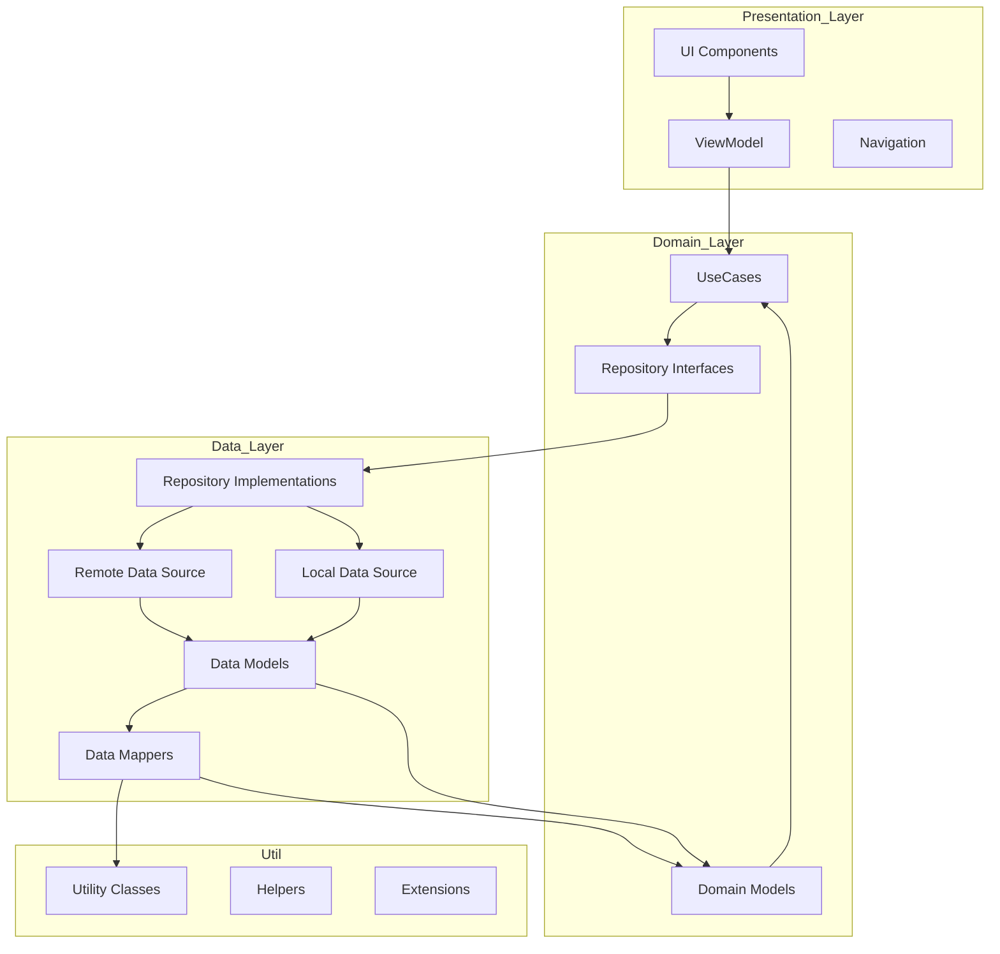
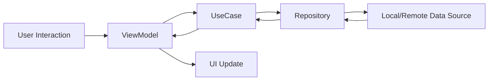
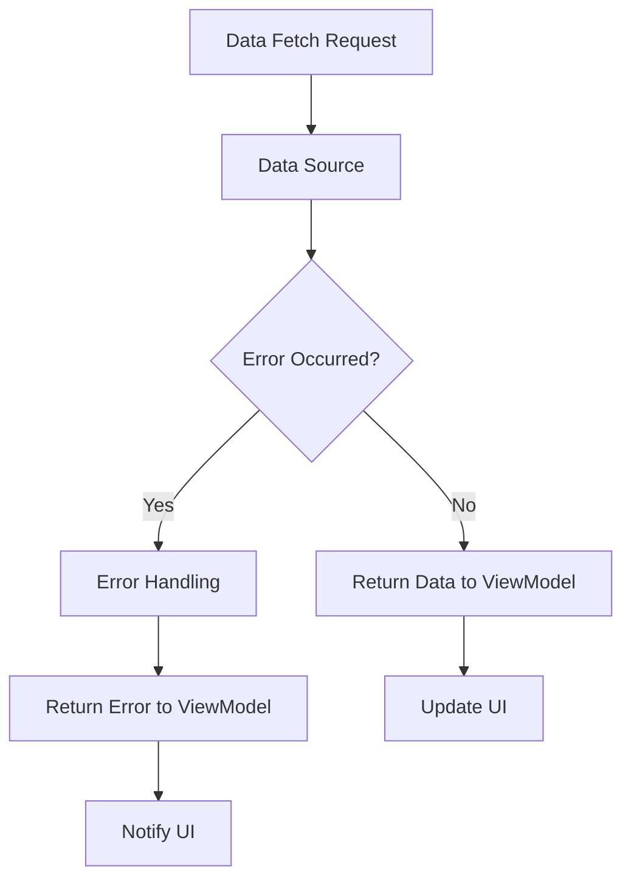

## Android Clean Architecture MVVM


Android uygulama geliştirmede modern mimarilerden biri olan Clean Architecture ve MVVM (Model-View-ViewModel) Clean Architecture, uygulamanın farklı bileşenlerini bağımsız hale getiren, sürdürülebilir ve test edilebilir bir yapıyı benimseyerek, kodun daha yönetilebilir olmasını sağlar. MVVM ise, kullanıcı arayüzü (UI) ile iş mantığını birbirinden ayıran bir desen olup, UI'nin iş mantığından bağımsız olarak çalışmasını sağlar. Android'deki Clean Architecture yapısı genellikle dört ana katmandan oluşur: Presentation, Domain, Data, ve Util. MVVM mimarisi ise özellikle Presentation katmanında kullanılır. Bu yapılar birlikte, uygulamanın ölçeklenebilirliğini artırır, test edilebilirliğini sağlar ve bakımını kolaylaştırır.

## Basit Bir Clean Architecture Akış Diyagramı


# Android için Clean Architecture paket yapısı
- **data**
    - local
    - remote
    - mapper
    - repository
- **di**
- **domain**
    - repository
    - model
    - usecase
- **presentation**
    - common
      - navigation
      - components
    - viewmodel
    - screens
      - home
- **util**

# Data
Data paketi, uygulamanın veri yönetimi ve veri kaynaklarıyla doğrudan etkileşim kurduğu katmandır. Bu katmanda, veri modelleri, veri kaynaklarına erişim sağlayan sınıflar ve veriyi dönüştüren (mapper) sınıflar bulunur.
- **Local**
    - Local paketinin içerisinde yerel veri kaynaklarına erişim sağlanır. Bunlar kotlin için örneğin room kütüphanesinin databaseleridir.
    - İçinde `Dao`, `Database` ve `Entity` olmak üzere 3 farklı paket barındırıyor. Öncelikle Entity paketimizi oluşturarak başlayalım
       ``` kotlin
       @Entity
       data class Cocktails(
       val idDrink: String,
       val strAlcoholic: String,
       val strCategory: String,
       val strDrink: String,
       val strDrinkThumb: String,
       val strInstructions: String,
       @PrimaryKey(autoGenerate = true)
       val id : Int = 0
       )
       ```
   - Ardından Dao paketimizi oluşturalım.
      ``` kotlin
      @Dao
      interface CocktailsDao {

      @Query("SELECT * FROM Cocktails")
      fun getAllCocktails() : Flow<List<Cocktails>>

      @Insert(onConflict = OnConflictStrategy.REPLACE)
      suspend fun insertCocktails(cocktails: Cocktails)

      @Query("DELETE FROM Cocktails WHERE id = :id")
      suspend fun deleteCocktailById(id:Int)

      @Query("DELETE FROM Cocktails")
      suspend fun deleteAllCocktails()
      }
      ```
   - En son olarak database paketini oluşturarak local içindeki room databasemizi oluşturalım.        
      ``` kotlin
      @Database(entities = [Cocktails::class], version = 1)
      abstract class CocktailsDatabase : RoomDatabase() {

      abstract fun cocktailsDao(): CocktailsDao

      companion object {
      @Volatile
      private var INSTANCE: CocktailsDatabase? = null

      fun getDatabase(context: Context): CocktailsDatabase {
            return INSTANCE ?: synchronized(this) {
                val instance = Room.databaseBuilder(
                    context.applicationContext,
                    CocktailsDatabase::class.java,
                    "cocktails_database"
                    ).build()
                    INSTANCE = instance
                    instance
                }
            }
        }
     }
     ```
    
- **Remote**
    - Remote paketinin içerisinde uzak veri uzak veri kaynaklarına erişim sağlanır. API'den veri çekme `DTO(Data Transfering Object)` benzeri şeyler bu katmanda yer alır.
     - Burada Retrofit kullanarak oluşturduğumz bir interfacemiz var
       ``` kotlin
       interface RandomCocktailAPI {
       @GET("random.php")
       suspend fun getRandomCocktail() : CocktailDto
       }
       ``` 
     - Dto paketimizin içinde Remote kaynağındaki RandomCocktailAPI içindeki getRandomCocktail() çalıştığında gelecek veri CocktailDto'ya Aktarılıyor
       ``` kotlin
       data class CocktailDto(
       val drinks: List<Drink>
       )
       ```
     - CocktailDto'dan da Drink'e Yönlendiriyor
       ``` kotlin
       val dateModified: String,
       val idDrink: String,
       val strAlcoholic: String,
       val strCategory: String,
       val strCreativeCommonsConfirmed: String,
       val strDrink: String,
       val strDrinkAlternate: Any,
       val strDrinkThumb: String,
       val strGlass: String,
       val strIBA: Any,
       val strImageAttribution: Any,
       val strImageSource: Any,
       val strIngredient1: String,
       val strIngredient10: Any,
       val strIngredient11: Any,
       val strIngredient12: Any,
       val strIngredient13: Any,
       val strIngredient14: Any,
       val strIngredient15: Any,
       val strIngredient2: String,
       val strIngredient3: String,
       val strIngredient4: Any,
       val strIngredient5: Any,
       val strIngredient6: Any,
       val strIngredient7: Any,
       val strIngredient8: Any,
       val strIngredient9: Any,
       val strInstructions: String,
       val strInstructionsDE: String,
       val strInstructionsES: String,
       val strInstructionsFR: String,
       val strInstructionsIT: String,
       val strInstructionsZHHANS: Any,
       val strInstructionsZHHANT: Any,
       val strMeasure1: String,
       val strMeasure10: Any,
       val strMeasure11: Any,
       val strMeasure12: Any,
       val strMeasure13: Any,
       val strMeasure14: Any,
       val strMeasure15: Any,
       val strMeasure2: String,
       val strMeasure3: String,
       val strMeasure4: Any,
       val strMeasure5: Any,
       val strMeasure6: Any,
       val strMeasure7: Any,
       val strMeasure8: Any,
       val strMeasure9: Any,
       val strTags: Any,
       val strVideo: Any
       ```
     Göründüğü üzere burada bir çok verimiz var fakat uygulamamız için 6 adet veri işimizi görüyor bu verileri direkt olarak aktarmak yerine bu verileri Mapper içinde mapleyerek kullanacağımız bir data class'a aktarıp işimizi kolaylaştıracağız.
  
- **Mapper**
    - Mapper kaynağı Data paketeinin içinde veya bunlardan bağımsız başka bir katman olarak tanımlanabilir. Mapper katmanı veriyi başka bir katmana dönüştürür. Örneğin Remote paketinin içinde bulunan bir API'yi çektik fakat uygulamada kullandığımız ve kullanmadığımız verileride getirdi bu durumda gelen verileri mapleyip, Domain Paketinin içindeki Modelimize dönüştürürüz.
       ``` kotlin
      fun CocktailDto.toCocktail(): List<Cocktail> {
      return drinks.map {
        Cocktail(
            strInstructions = it.strInstructions,
            strAlcoholic = it.strAlcoholic,
            strDrink = it.strDrink,
            strCategory = it.strCategory,
            strDrinkThumb = it.strDrinkThumb,
            idDrink = it.idDrink,
           )
         }
       }
       ```
       Burada CocktailDto'ya gelen verilerimizi alarak `Domain/Model` paketinde bulunan Cocktail data class'ına çevirip ihtiyacımız olan(Kullanacağımız) veriyi alıyoruz. 

# DI(Dependency Injection)

DI (Dependency Injection) paketi, Dependency Injection (Bağımlılık Enjeksiyonu) yapılandırmalarını içerir. `Repository`, `Usecase`, `Remote` ve `Local` veri kaynakları gibi bağımlılıkları sağlayan Hilt/Dagger modülleri burada yer alır. Bu modüller, ilgili bağımlılıkları sağlayarak uygulamanın diğer bölümlerinde ihtiyaç duyulan sınıfların otomatik olarak enjekte edilmesine olanak tanır.
   
   - Bu modüller, ilgili bağımlılıkları sağlayarak uygulamanın diğer bölümlerinde ihtiyaç duyulan sınıfların otomatik olarak enjekte edilmesine olanak tanır.

```kotlin
@InstallIn(SingletonComponent::class)
@Module
object CocktailModule {

    @Singleton
    @Provides
    fun provideRandomCocktailApi(): RandomCocktailAPI {
        return Retrofit.Builder()
            .baseUrl(BASE_URL)
            .addConverterFactory(GsonConverterFactory.create())
            .build()
            .create(RandomCocktailAPI::class.java)
    }

    @Singleton
    @Provides
    fun provideCocktailRepository(cocktailAPI: RandomCocktailAPI): CocktailRepository {
        return CocktailRepositoryImpl(cocktailAPI)
    }
}
```
```kotlin
@InstallIn(SingletonComponent::class)
@Module
object CocktailDatabaseModule {

    @Singleton
    @Provides
    fun provideCocktailDatabase(@ApplicationContext context: Context): CocktailsDatabase {
        return Room.databaseBuilder(
            context,
            CocktailsDatabase::class.java,
            "cocktails_database"
        ).build()
    }

    @Singleton
    @Provides
    fun provideCocktailDao(cocktailsDatabase: CocktailsDatabase): CocktailsDao {
        return cocktailsDatabase.cocktailsDao()
    }
}
```
```kotlin
@Module
@InstallIn(SingletonComponent::class)
abstract class CocktailRoomRepositoryModule {

    @Binds
    @Singleton
    abstract fun bindCocktailRoomRepository(
        cocktailRoomRepositoryImpl: CocktailRoomRepositoryImpl
    ): CocktailRoomRepository
}
```
# Domain 

Domain paketi uygulamanın iş mantığı ve temel modellerini içerir kısaca iş mantığı kısmı diyebiliriz. Domain paketinde hiçbir zaman Data ve Presentation kısımlarına bağımlılık olmaz.
- **Repository**
  - Domain paketi içerisinde bulunan repository kısmı Data paketindeki repositoriden farklıdır. Bu paketteki Repositoryler Interfacedir ve Data katmanında bulunan Repositoryler tarafından Implement edilir. Isimlendirmeler Domain paketi için `Repository`, Data paketi için `RepositoryImpl` olarak yapılır.
  - Repository Interface'imiz
```kotlin
interface CocktailRoomRepository {
    fun getAllCocktails() : Flow<List<Cocktails>>
    suspend fun insertCocktails(cocktails: Cocktails)
    suspend fun deleteCocktailById(id:Int)
    suspend fun deleteAllCocktails()
}
```
  - Repository'i Implement eden RepositoryImpl'imiz
```kotlin
class CocktailRoomRepositoryImpl @Inject constructor(private val cocktailsDao: CocktailsDao) : CocktailRoomRepository {
    override fun getAllCocktails(): Flow<List<Cocktails>> {
        return cocktailsDao.getAllCocktails()
    }

    override suspend fun insertCocktails(cocktails: Cocktails) {
        cocktailsDao.insertCocktails(cocktails)
    }

    override suspend fun deleteCocktailById(id: Int) {
        cocktailsDao.deleteCocktailById(id)
    }

    override suspend fun deleteAllCocktails() {
        cocktailsDao.deleteAllCocktails()
    }

}
```
- **Model**
  - Domain paketinde kullanılan veri modellerini içerir. Data/Remote aracılığıyla gelen veriler Data/Mapper altında dönüştürülerek bu katmandaki Modele aktarılır.
```kotlin
data class Cocktail(
    val idDrink: String,
    val strAlcoholic: String,
    val strCategory: String,
    val strDrink: String,
    val strDrinkThumb: String,
    val strInstructions: String,
)
```
- **Usecase**
  - Uygulamanın belli bir işlevselliğini getiren iş mantıklarını içeren pakettir. Örneğin Data/Remote içerisinden verileri getirir.
```kotlin
class DeleteAllDatabaseUseCase @Inject constructor(
    private val cocktailRoomRepository: CocktailRoomRepository
) {
    suspend operator fun invoke() {
        cocktailRoomRepository.deleteAllCocktails()
    }
}

class DeleteCocktailByIdUseCase @Inject constructor(
    private val cocktailRoomRepository: CocktailRoomRepository
) {
    suspend operator fun invoke(id: Int) {
        cocktailRoomRepository.deleteCocktailById(id)
    }
}

class GetAllCocktailsUseCase @Inject constructor(
    private val cocktailRoomRepository: CocktailRoomRepository
) {
    operator fun invoke(): Flow<List<Cocktails>> {
        return cocktailRoomRepository.getAllCocktails()
    }
}

class InsertCocktailUseCase @Inject constructor(
    private val cocktailRoomRepository: CocktailRoomRepository
) {
    suspend operator fun invoke(cocktails: Cocktails) {
        cocktailRoomRepository.insertCocktails(cocktails)
    }
}

```

# Util

Util paketi, uygulamanın her katmanında kullanılabilecek yardımcı sınıfları ve fonksiyonları içerir. Tekrar eden kodların bu pakette toplanması uygulamayı daha modüler ve düzenli hale getirir. 
Örneğin 
  - Constants: Uygulama genelinde kullanılacak sabitler tanımlanır.
```kotlin
object Constant {
    const val BASE_URL = "https://www.thecocktaildb.com/api/json/v1/1/"
}
```
# Presentation

Presentation paketi, uygulamanın kullanıcı arayüzüyle etkileşimde olduğu katmandır. MVVM (Model-View-ViewModel) yapısını kullanarak ViewModel’leri ve UI bileşenlerini içerir.
- **Viewmodel**
  - Her bir ekran için bir ViewModel sınıfı tanımlanır. ViewModel sınıfları, `Usecase` sınıflarını çağırarak veriyi elde eder ve UI’a uygun hale getirir. Bu ViewModel’ler, Dependency Injection ile ilgili UseCase’leri alır ve gerekli işlemleri yönetir.
  - Remote Kaynağını kullanan HomeViewModel Örneği ;
```kotlin
@HiltViewModel
class HomeViewModel @Inject constructor(
    private val randomCocktailUseCase: RandomCocktailUseCase
) : ViewModel() {

    private val _state = MutableStateFlow(CocktailState())
    val state: StateFlow<CocktailState> = _state

    private var job: Job? = null


    init {
        getRandomCocktail()
    }

    fun getRandomCocktail() {
        job?.cancel()

        job = randomCocktailUseCase.getRandomCocktails().onEach { result ->
            when (result) {
                is Resource.Success -> {
                    _state.value = _state.value.copy(
                        cocktails = result.data ?: emptyList(),
                        isLoading = false,
                        error = ""
                    )
                }
                is Resource.Loading -> {
                    _state.value = _state.value.copy(
                        isLoading = true,
                        error = ""
                    )
                }
                is Resource.Error -> {
                    _state.value = _state.value.copy(
                        error = result.message ?: "An error occurred",
                        isLoading = false
                    )
                }
            }
        }.launchIn(viewModelScope)
    }
}
```
  - Local Kaynağını kullanan HomeViewModel Örneği ;
```kotlin
@HiltViewModel
class ManageCocktailViewModel @Inject constructor(
    private val getAllCocktailsUseCase: GetAllCocktailsUseCase,
    private val deleteCocktailByIdUseCase: DeleteCocktailByIdUseCase,
    private val deleteAllDatabaseUseCase: DeleteAllDatabaseUseCase,
) : ViewModel() {

    private val _cocktails = MutableStateFlow<List<Cocktails>>(emptyList())
    val cocktails: StateFlow<List<Cocktails>> = _cocktails

    init {
        fetchAllCocktails()
    }

    private fun fetchAllCocktails() {
        viewModelScope.launch {
            getAllCocktailsUseCase().collect { cocktailsList ->
                _cocktails.value = cocktailsList
            }
        }
    }

    fun deleteCocktailById(id: Int) {
        viewModelScope.launch {
            deleteCocktailByIdUseCase(id)
        }
    }

    private fun deleteAllCocktails(){
        viewModelScope.launch {
            deleteAllDatabaseUseCase()
        }
    }
}
```  
- **Common**
  - Bu kısımda Navigation ve Component gibi çoğu ekran tarafından kullanılan fonksiyonları ve dosyaları barındırır.
- **Screens**
  -  Bu pakette kullanıcya sunulan UI sayfaları yer alır. Örneğin Home sayfası için bir paket açılır, sadece home paketinde kullanılan Componentler ve sayfa burada yer alır.
    
# MVVM(Model-View-ViewModel)


ViewModel, MVVM (Model-View-ViewModel) mimarisinde UI (kullanıcı arayüzü) ile iş mantığı arasındaki bağlantıyı sağlayan bileşendir. Özellikle Android uygulamalarında kullanıcının uygulama ile etkileşime geçtiği süreçleri daha yönetilebilir hale getirmek için kullanılır.

- **Veriyi Yönetme ve Sağlama:**
  
  - ViewModel, UI’nın ihtiyaç duyduğu veriyi LiveData, StateFlow, MutableState gibi gözlemlenebilir (observable) veri türleri kullanarak sağlar.
  - Örneğin, bir kullanıcı arayüzünde bir listede gösterilecek veriyi ViewModel alır ve ViewModel, UI’ya bu veriyi sağlamaktan sorumludur. Böylece, verinin alınması veya güncellenmesi gerektiğinde yalnızca ViewModel güncellenir ve UI da bu değişiklikleri gözlemleyerek kendini günceller.

- **UI Durumunu Koruma:**

  - Android’in yaşam döngüsüne duyarlı olarak, ViewModel ekran döndürüldüğünde veya uygulama arka plana alınıp yeniden açıldığında veri kaybını önler.
  - ViewModel, aktivite veya fragment yeniden oluşturulsa bile yaşam döngüsünden bağımsız olarak varlığını koruduğu için UI durumu kalıcı olur.

- **Veri İşlemlerini ve İş Mantığını Yönetme:**

  - İş mantığına göre Repository ya da UseCase sınıflarını çağırarak veri işlemlerini yönetir.
  - Örneğin, bir ürün listesi gösteriliyorsa ViewModel ilgili UseCase veya Repository sınıfını çağırarak ürünleri getirir. Bu veri işlemlerini UI katmanında yapmak yerine ViewModel üzerinden yönetmek, kodun okunabilirliğini artırır ve test edilebilirliğini kolaylaştırır.

- **UI’ı Güncel Tutma:**

  - ViewModel, iş mantığında veya veri akışında değişiklik olduğunda UI’yı günceller.
  - Örneğin, bir API çağrısı yapıldığında veya yerel veritabanında bir güncelleme gerçekleştiğinde bu değişikliği UI’ya bildirir. UI katmanı sadece ViewModel’den gelen değişikliklere göre güncellenir ve veri akışını doğrudan kontrol etmez.

- **Uygulamanın UI Katmanını Temiz Tutma:**

  - ViewModel, iş mantığını ve veri yönetimini üstlenerek UI katmanında bu işlemlerin yapılmasını önler. Bu sayede UI sınıfları (örneğin Activity veya Fragment) yalnızca kullanıcı etkileşimlerini yakalar ve bu etkileşimleri ViewModel’e iletir.
  - UI katmanını yalnızca görselleştirmeye odaklayarak daha modüler ve sorumlulukları belirli bir yapı sağlar.

## ViewModel'in Avantajları
 - Veri Korunur: ViewModel, yaşam döngüsüne duyarlı olduğu için uygulamanın UI durumu ekran döndürülse bile korunur.
 - Sorumluluk Ayrımı: Veri işlemleri ve UI yönetimi birbirinden ayrılır, bu da daha temiz bir yapı sağlar.
 - Test Edilebilirlik: ViewModel, UI’dan bağımsız olduğu için iş mantığı testleri kolaylıkla yapılabilir.
 - Modülerlik: İş mantığının ayrı bir bileşende olması, kodun yeniden kullanılabilirliğini ve genişletilebilirliğini artırır.

Kısacası ViewModel, veriyi yönetme, UI güncelleme ve iş mantığını yönetme gibi görevleriyle uygulamanın yapı taşlarından biridir.


## Veri Akış Diyagramı 


## Hata Yönetimi Akış Diyagramı

## Kaynaklar
- [Android Developer Documentation](https://developer.android.com) Android uygulama geliştirme konusunda resmi kaynaklardan biri, Android için gerekli tüm temel belgeleri, örnekleri ve rehberleri sunar.

- [Jetpack Compose Documentation](https://developer.android.com/jetpack/compose), Android için modern UI araçları sunar. Bu kaynak, kullanıcı arayüzü geliştirmek için gerekli bileşenleri ve araçları sunarak Compose hakkında detaylı bilgiler sağlar.

- [Android Architecture](https://developer.android.com/topic/architecture), Android uygulama geliştirme için doğru mimari desenleri ve uygulama yapılarını benimsemek isteyen geliştiriciler için rehberlik eder. Clean Architecture, MVVM ve diğer modern Android mimarisi yaklaşımlarını anlatan bu sayfa, uygulama yapılandırmalarını, bileşenlerini ve veri yönetimini nasıl organize edeceğiniz konusunda ayrıntılı bilgiler sunar.
